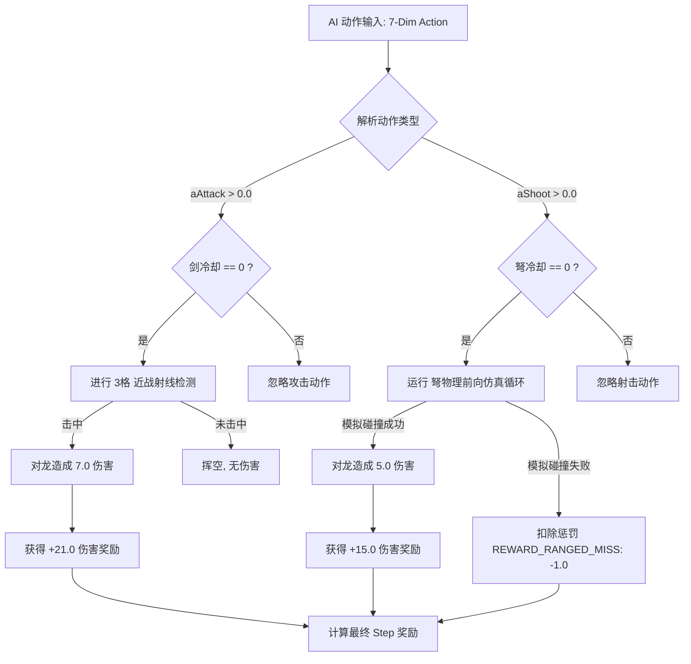

# Minecraft AI 远程武器（弩）引入与阶段二训练设计方案

## 1. 背景与痛点分析

在现有的阶段二（移动龙 AI）训练中，末影龙的大部分时间都在空中飞翔（执行 `HOLDING_PATTERN`、`HOVER` 等飞行阶段的 AI）。由于飞龙的高度和水平距离通常远超 **15 格**，而 AI 目前仅装备钻石剑（有效近战距离仅 **3 格**），这导致：
1. **样本效率极低**：在单次 Episode（最大 18000 tick / 15分钟）中，有超过 **80%** 的时间 AI 只能在地面“傻等”或进行无效的移动，无法对龙造成任何伤害。
2. **正向奖励极其稀疏**：由于缺乏远程攻击手段，AI 无法在飞龙阶段获得正向伤害反馈，导致策略网络（PPO）难以收敛，走位和瞄准学习变得异常缓慢。

为了解决这一痛点，我们提议为 AI 引入**远程武器（弩/弓）**，通过合理的工程简化，让 AI 能够在飞龙阶段积极与龙互动，大幅提升数据采集的质量和模型的收敛速度。

---

## 2. 核心设计决策

### 2.1 瞬发机制与真实弹道的折中：模拟弹道瞬发 (Simulated Ballistic Hitscan)

在强化学习中，直接使用原版物理箭矢实体（Projectile）会带来两个致命挑战：
* **时序延迟奖励 (Delayed Reward)**：从射出箭矢到命中龙有数个 tick 的延迟，PPO 很难在没有记忆机制（如 LSTM）的情况下将“开火动作”与“延迟伤害奖励”直接关联（时间信用分配问题）。
* **复杂的弹道预判**：AI 必须学会根据距离抬高准星（重力补偿）以及预瞄移动中的龙（前置量预判）。

为了能在**后期无缝切换为原版物理箭矢实体**，同时**保留强化学习即时奖励的快速收敛优势**，我们设计了**“模拟弹道瞬发 (Simulated Ballistic Hitscan)”**机制。

#### 机制原理：
1. 当 AI 发出射击信号（`aShoot > 0.0` 且 `ranged_cooldown == 0`）时，服务端在**当前 tick 内**进行一个快速的**物理前向仿真循环**。
2. 设定箭矢的初始物理参数（初始速度 $v_0 = 3.0$ 格/tick，重力加速度 $g = 0.05$ 格/tick²，空气阻力系数 $0.99$）。
3. 在循环中逐 tick 计算箭矢的模拟位置 $\vec{P}_{arrow}(t)$，同时根据龙当前的运动速度 $\vec{V}_{dragon}$，计算龙的碰撞箱在未来时刻 $t$ 的估算位置（将碰撞箱平移 $\vec{V}_{dragon} \times t$）。
4. 判断模拟箭矢是否与该未来时刻的龙碰撞箱相交：
   * **若相交**：判定为**命中**，并在**当前 tick 瞬间施加伤害和发放奖励**。
   * **若未相交且超出范围/落地**：判定为 **Miss**。
5. **粒子连线**：在客户端生成从玩家到实际命中点（或最终模拟终点）的粒子连线轨迹，播放音效。

#### 为什么这是完美的解决方案？
* **瞬时奖励反馈**：伤害和奖励是在 AI 按下扳机的**同一个 tick** 内发生的，消除了时序延迟，对 PPO 极度友好。
* **瞄准行为完全对齐**：AI 必须像打原版弓箭一样，**往龙的上方瞄准（补偿重力下坠）**并**往龙的运动方向前侧瞄准（补偿弹道飞行时间）**。如果 AI 依然像普通 Hitscan 那样直直地对准龙开火，模拟的重力与龙的位移偏移量会导致箭矢“擦肩而过”，从而被判定为 Miss。
* **无缝切换原版**：当训练完成后切换为原版箭矢实体时，**AI 已经学会了完美的物理弹道预判和瞄准动作**，策略网络不需要做任何重新训练，只需适应极小的伤害延迟即可。

---

### 2.2 冷却时间（Cooldown）与动作屏蔽机制

* **为什么需要冷却**：如果没有冷却限制，AI 可以在瞬间连续发射上百支箭瞬间秒杀末影龙，这不仅破坏了游戏动力学，还会导致 AI 彻底抛弃近战剑的使用。
* **冷却时间设定**：建议设定为 **30 ticks（1.5 秒）**，略长于原版中无附魔弩的装填时间（25 ticks），以限制远程攻击的输出效率。
* **屏蔽机制 (Masking)**：
  * 在动作空间中新增一维射击输入 `aShoot`。当 `aShoot > 0.0` 且 `ranged_cooldown == 0` 时，执行一次射击。
  * 若 `ranged_cooldown > 0`，即使 AI 发出射击信号，服务端也会静默忽略该动作（但不清除冷却时间）。
  * 将当前剩余的 `ranged_cooldown` 归一化后加入观察空间，引导 AI 学会“只在冷却完毕时尝试开火”。

---

### 2.3 武器数值平衡：如何保证不忘记使用“剑”

为了防止 AI 在引入远程武器后彻底变为“狙击手”而完全忘记使用剑，我们必须通过**冷却时间**和**伤害数值**设计，在近战和远程之间建立巨大的 **DPS（每秒伤害）差距**：

| 武器 | 伤害 (Damage) | 冷却时间 (Cooldown) | 单体最大 DPS | 龙坐下/降落乘数 | 实际最大 DPS | 射程范围 |
| :--- | :--- | :--- | :--- | :--- | :--- | :--- |
| **钻石剑** | 7.0 (3.5 ❤) | 12 ticks (0.6s) | **11.67** | **2.0x** | **23.33** | 3 格内 |
| **远程（弩）**| 5.0 (2.5 ❤) | 30 ticks (1.5s) | **3.33** | **1.0x** | **3.33** | 100 格内 |

#### 收益自适应逻辑：
1. **近战 DPS 是远程的 3.5 到 7 倍**：由于钻石剑冷却快且在龙坐下时有 2 倍伤害加成，在近距离范围内，使用剑能以极快的速度积攒极高的伤害奖励。
2. **射程自适应**：
   * **龙在空中飞**：剑的有效距离为 0。远程武器是**唯一**能够获得伤害奖励（3.33 DPS）的途径。AI 将学会精准狙击飞龙。
   * **龙降落/坐下**：近战范围开启。AI 会发现冲过去贴脸肉搏能提供 **7 倍于远程射击的奖励流速**。基于理性奖励最大化原则，AI 必然会优先使用钻石剑。

---

## 3. 动作与观察空间修改

### 3.1 动作空间扩展（6维 → 7维）
在 Python 端的 `DragonEnv` 中，将 `self.action_space` 扩展为 7 维：
`self.action_space = spaces.Box(low=-1.0, high=1.0, shape=(7,), dtype=np.float32)`

* **新动作排布**：
  * `[0-3]`: 移动与转向 (`aMoveX`, `aMoveZ`, `aYaw`, `aPitch`)
  * `[4]`: **近战攻击 (`aAttack`)** —— 控制钻石剑
  * `[5]`: **跳跃 (`aJump`)**
  * `[6]`: **远程射击 (`aShoot`)** —— 控制弩箭发射

### 3.2 观察空间扩展（38维 → 39维）
在 `DragonEnv._parse_obs` 中，将观察矩阵扩展为 39 维：
* **新增第 39 维特征**：`ranged_cooldown` (归一化 `[0.0, 1.0]`，`0.0` 表示就绪，`1.0` 表示刚刚发射)。

---

## 4. 奖励函数设计 (Reward Design)

保持核心纯伤害奖励系数 `REWARD_DRAGON_DAMAGE = 3.0`。
1. **近战命中**：造成 7.0 伤害 → 获得 `+21.0` 奖励（坐下时伤害 x2，获得 `+42.0` 奖励）。
2. **远程命中**：造成 5.0 伤害 → 获得 `+15.0` 奖励。
3. **新增：射击落空惩罚 (Ranged Miss Penalty)**：
   * 若 AI 触发了射击判定（`aShoot > 0.0` 且 `ranged_cooldown == 0`）但仿真轨道**未击中龙**。
   * 给予一次性惩罚：`REWARD_RANGED_MISS = -1.0`。
   * **目的**：限制 AI 盲目、随机地开火。强迫其在开火前必须调整姿态，使预估的物理落点能精准打中龙。

---

## 5. 核心逻辑决策流程



---

## 6. 核心代码变更指引 (Java & Python)

### 6.1 Java 端更改

#### `ActionParser.java` 增加远程射击逻辑与冷却计数
```java
// 新增静态变量
private static int rangedCooldown = 0;
private static final int RANGED_COOLDOWN_TICKS = 30; // 1.5 秒
private static final double RANGED_DAMAGE = 5.0;

private static boolean rangedMissThisCycle = false;
private static boolean rangedHitThisCycle = false;

public static void reset() {
    // ... 原有重置 ...
    rangedCooldown = 0;
    rangedMissThisCycle = false;
    rangedHitThisCycle = false;
}

public static void execute(JsonArray actionArray, ServerPlayerEntity player, ServerWorld world) {
    // ... 原有动作 0 至 5 的解析 ...
    
    // 动作索引 6 为远程射击
    float aShoot = actionArray.get(6).getAsFloat();
    rangedMissThisCycle = false;
    rangedHitThisCycle = false;
    
    if (aShoot > 0.0f) {
        performRangedAttack(player, world);
    }
}

public static void tickExecute(ServerPlayerEntity player, ServerWorld world) {
    // ... 原有剑冷却递减与移动逻辑 ...
    
    // 递减远程冷却
    if (rangedCooldown > 0) {
        rangedCooldown--;
    }
}

private static void performRangedAttack(ServerPlayerEntity player, ServerWorld world) {
    if (rangedCooldown > 0) return; // 处于冷却中，直接过滤
    
    EnderDragonEntity dragon = ObservationBuilder.getDragon(world);
    if (dragon == null) return;
    
    Vec3d eyePos = player.getCameraPosVec(0.0F);
    Vec3d lookVec = player.getRotationVec(0.0F);
    
    // 仿真箭矢物理参数 (原版弩箭初速度约为 3.0 blocks/tick)
    double initialSpeed = 3.0;
    Vec3d velocity = lookVec.multiply(initialSpeed);
    Vec3d arrowPos = eyePos;
    Vec3d dragonVel = dragon.getVelocity();
    
    boolean hit = false;
    Entity hitPart = null;
    Vec3d hitPos = null;
    
    // 模拟最多 60 tick 的飞行轨迹 (最大约 180 格距离)
    for (int tick = 0; tick < 60; tick++) {
        // 应用重力与阻力 (阻力 0.99, 重力 0.05)
        velocity = velocity.multiply(0.99);
        velocity = new Vec3d(velocity.x, velocity.y - 0.05, velocity.z);
        arrowPos = arrowPos.add(velocity);
        
        // 估算第 t tick 时，龙各个部位平移后的位置 (当前位置 + 速度 * tick)
        Vec3d offset = dragonVel.multiply(tick);
        
        for (EnderDragonPart part : dragon.getBodyParts()) {
            Box futureBox = part.getBoundingBox().offset(offset);
            
            // 如果箭矢模拟坐标落入了未来时刻的碰撞箱内，判定命中
            if (futureBox.contains(arrowPos)) {
                hit = true;
                hitPart = part;
                hitPos = arrowPos;
                break;
            }
        }
        
        if (hit) break;
        
        // 落地或穿过虚空高度则提前终止仿真
        if (arrowPos.y < world.getBottomY()) break;
    }
    
    if (hit && hitPart != null) {
        // 击中龙
        hitPart.damage(world.getDamageSources().playerAttack(player), (float) RANGED_DAMAGE);
        rangedHitThisCycle = true;
        
        // 播放效果
        world.playSound(null, player.getX(), player.getY(), player.getZ(), 
            SoundEvents.ENTITY_ARROW_HIT_PLAYER, SoundCategory.PLAYERS, 1.0F, 1.0F);
        spawnShootParticles(world, eyePos, hitPos);
    } else {
        // 未击中
        rangedMissThisCycle = true;
        world.playSound(null, player.getX(), player.getY(), player.getZ(), 
            SoundEvents.ITEM_CROSSBOW_SHOOT, SoundCategory.PLAYERS, 1.0F, 1.0F);
        spawnShootParticles(world, eyePos, arrowPos); // 粒子追踪延伸至飞行终点
    }
    
    rangedCooldown = RANGED_COOLDOWN_TICKS;
}

// 粒子连线模拟物理抛物线轨迹
private static void spawnShootParticles(ServerWorld world, Vec3d start, Vec3d end) {
    Vec3d dir = end.subtract(start);
    double dist = dir.length();
    int count = (int) (dist * 2); // 每格生成 2 个粒子
    for (int i = 0; i < count; i++) {
        double ratio = (double) i / count;
        Vec3d point = start.add(dir.multiply(ratio));
        world.spawnParticles(ParticleTypes.CRIT, point.x, point.y, point.z, 
            1, 0, 0, 0, 0.0);
    }
}

// 获取冷却比例 [0, 1] 用于观察空间
public static float getRangedCooldownProgress() {
    return (float) rangedCooldown / RANGED_COOLDOWN_TICKS;
}

public static boolean wasRangedMiss() { return rangedMissThisCycle; }
public static boolean wasRangedHit() { return rangedHitThisCycle; }
```

#### `ObservationBuilder.java` 提供远程冷却特征
```java
private static JsonObject buildStats(float attackCooldown) {
    JsonObject obj = new JsonObject();
    obj.addProperty("attack_cooldown", attackCooldown);
    obj.addProperty("ranged_cooldown", ActionParser.getRangedCooldownProgress());
    obj.addProperty("last_hit_type", ActionParser.getLastHitType());
    return obj;
}
```

#### `RLTickHandler.java` 处理射击惩罚
```java
// 在 RLTickHandler.sendObservation() 中计算总奖励时加入：
if (ActionParser.wasRangedMiss()) {
    totalReward += -1.0; // 扣除未击中惩罚，可在 RLConfig 里定义 REWARD_RANGED_MISS = -1.0
}
```

### 6.2 Python 端更改

#### `dragon_env.py` 扩充空间声明与解析
```python
# train/env/dragon_env.py

# 动作空间调整为 7 维
self.action_space = spaces.Box(low=-1.0, high=1.0, shape=(7,), dtype=np.float32)

# 观察空间调整为 39 维
obs_dim = 39
self.observation_space = spaces.Box(
    low=-1.0, high=1.0, shape=(obs_dim,), dtype=np.float32
)

def _parse_obs(self, data: dict) -> np.ndarray:
    vec = []
    # ... 原有 player, dragon_relative, dragon_phase 状态解析 ...
    
    # stats 状态扩展：读取新增的 ranged_cooldown 
    s = data.get("stats", {})
    vec.append(np.clip(float(s.get("attack_cooldown", 1.0)), 0.0, 1.0))
    vec.append(np.clip(float(s.get("ranged_cooldown", 0.0)), 0.0, 1.0)) # 新增
    vec.append(float(s.get("last_hit_type", 0)) / 2.0)
    
    # ... 其余地块与 breath 解析不变 ...
    return np.array(vec, dtype=np.float32)
```

---

## 7. 预期收益与效果总结

1. **物理弹道瞄准的渐进学习**：利用服务器的前向物理轨迹模拟，AI 可以立刻（0 延迟）得知当前的瞄准角度是否符合抛物线物理。因此，AI 会学会“在远距离往高处瞄准”以及“对准运动方向的前方开火”，为后期替换为原版实体箭矢打下完美的基础。
2. **飞龙阶段积极交互**：AI 开始主动调整视角并进行远程开火，极大减小了无效探索时间，使每个 Episode 的有效射击和动作分布更加饱满。
3. **混合武器策略的自进化**：由于近战的天然巨大 DPS 优势，AI 不会沉溺于远程狙击。在最终阶段，AI 将进化为：**“远距离持续抛物线射击狙击压血线 -> 龙降落时立即冲锋换剑贴脸疯狂输出”** 的完美战术策略。
